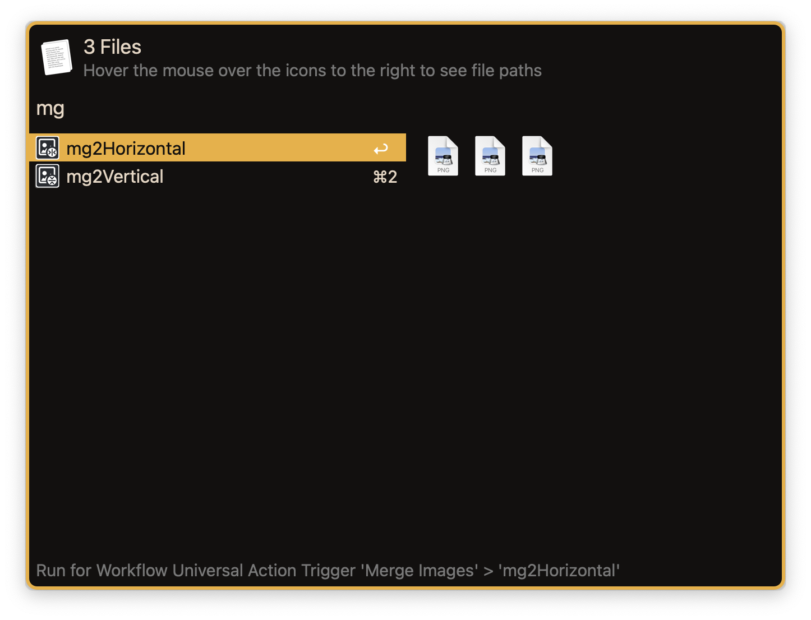
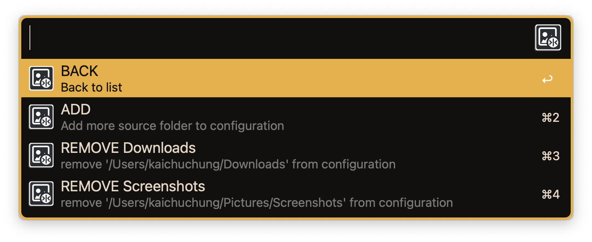
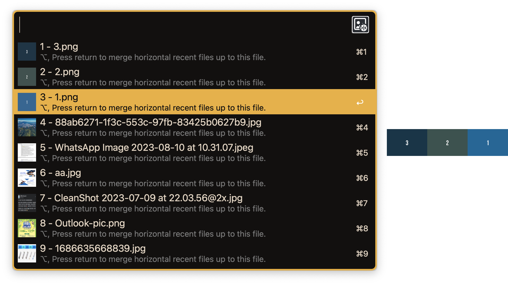
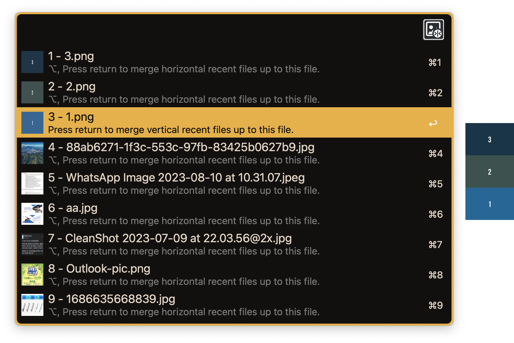
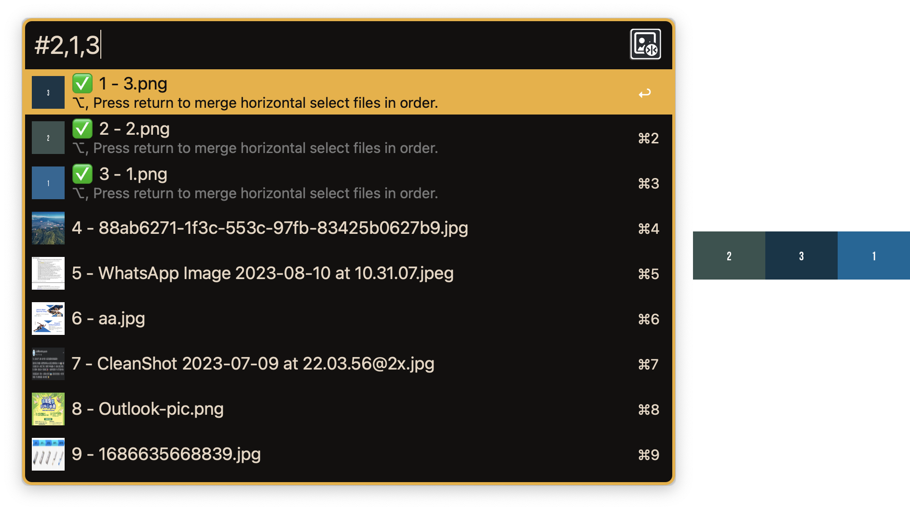
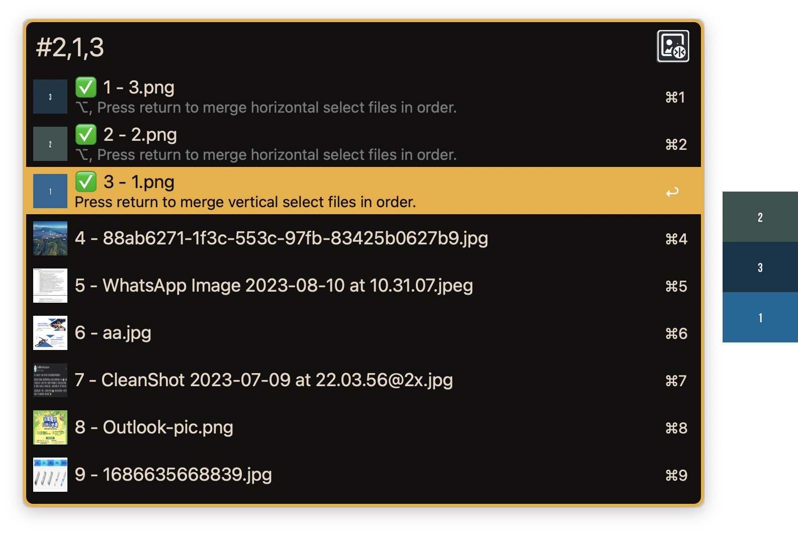

# alfred-mergeimgs

Alfred workflow to merge images as horizontal or vertical

## Prerequisites

- Alfred 5
- [sharkdp/fd: A simple, fast and user-friendly alternative to 'find'](https://github.com/sharkdp/fd)
- [ImageMagick – Convert, Edit, or Compose Digital Images](https://imagemagick.org/)

## Features

- Universal Action `mg2Horizontal` and `mg2Vertical` to merge images as horizontal or vertical
- Manage source folders to select images to merge quickly. `mga` to pick up source folders
- Custom image extension filter
- Custom output file name
- Custom background color
- Custom offset between images

## Installation

Visit the [Releases](https://github.com/cage1016/alfred-mergeimgs/releases) to download the latest release.

## Usage

### Universal Action

### Manage source folders

### `mga` to pick up source folders

### `mgf` Merge image as horizontal in order

### `mgf` Merge image as vertical in order

### `mgf` Custom merge order as horizontal

### `mgf` Custom merge order as vertical

## Change Log

### 0.1.0
- Initial release

## License
This project is licensed under the MIT License. See [LICENSE](LICENSE) for details.